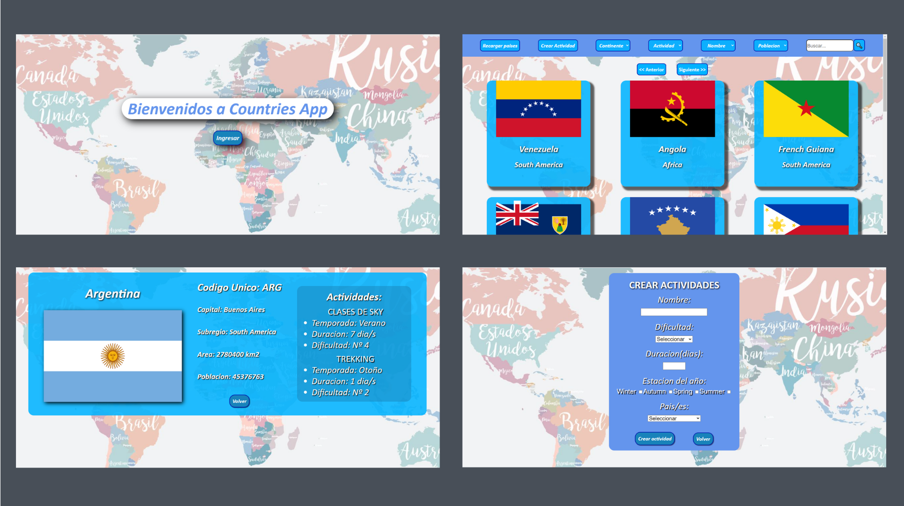
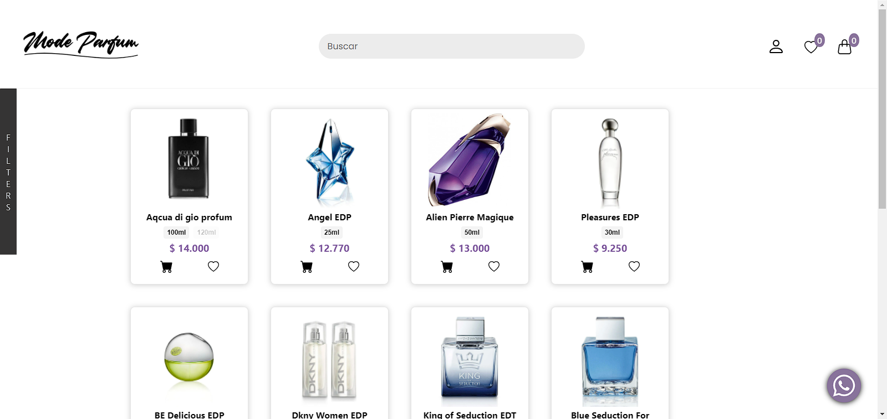

<h1 align="center">Hola! 👋 Mi nombre es Cristian Gabriel Cacciolatti y soy:</h1>

<h2 align="center">👩‍💻 Desarrollador Web Full Stack formado en la academia HENRY.</h2>

👶🖥️ Desde pequeño pude interactuar con una PC domestica en los tiempos donde no era algo comun. Esto me permitio poder experimientar, año tras año, el amplio mundo de posibilidades que brinda la informatica para las personas como por ejemplo educativas, telecomunicacionales, laborales, ocio, entre otras.

🎓 Fue asi que mis primeros pasos academicos los realice en la Universidad Nacional de Santiago del Estero, al anotarme en la carrera de Programador Universitario en Informatica.

🤩💻 Amo la programación y las computadoras. Soy una persona activa con buena disposición a lo social, me adapto rapido a un nuevo equipo de trabajo y me considero un autodidacta, lo que no entiendo o desconozco, lo investigo, no puedo quedarme con la duda. Ademas soy muy insisitente a la hora de realizar pruebas para detectar errores. 

👔 Estoy emocionado y entusiasmado de empezar esta nueva etapa de mi vida en el mundo IT. Si tienes un proyecto, anímate a invitarme, voy a ser un excelente capital humano para tu empresa!
¡ Contáctame y hablemos !

 
<h2>🧰 HABILIDADES TECNICAS:</h2>
<ul>
  <li><h3>JavaScript, HTML, CSS, ReactJS, ReduxJS, NodeJS, ExpressJS, PostgreSQL, Sequelize</h3></li>
</ul>

 
<h2>👨‍ HABILIDADES BLANDAS:</h2>
<ul>
  <li><h3>Sociable. Trabajo en equipo. Facilidad de adaptación. Personalidad amigable. Buena comunicación. Pensamiento critico. Buena Organización. Habilidades interpersonales. Puntualidad.</h3></li>
</ul>

 
<h2>📌 PROYECTOS:</h2>
<h3 align="center">Proyecto (Single Page Application) Countries App</h3>

  

🔹Consume datos de restcountries API.

🔹Posee con base de datos creada en PostgreSQL.

🔹Backend desarrollado con NodeJS utilizando Express.

🔹Frontend realizado con ReactJS & Redux, ademas CSS Modules.

🔹Cuenta con funcionalidades de ordenamiento por nombre y poblacion, filtro por continente y actividad y busqueda por nombre.

🔹Detalle y formulario de creacion de una actividad.

 
<h3 align="center">Proyecto E-Commerce MODE PARFUM</h3>

  

🔹Proyecto grupal - 8 personas.

🔹Maquetacion, creacion y diseño de una tienda de perfumeria.

🔹uncionalidades de filtrado por genero y marca, ordenamiento por precio y busqueda por nombre.

🔹Detalle individual de un producto.

🔹Favoritos, carrito de compras y sistema de loguin.

🔹Pasarela de pagos con MercadoPago Checkout Pro.

🔹Emails automaticos con Nodemailer (Registro, compra y resetaer contraseña).

🔹Panel administrador y funcionalidad de agregar producto.

<b>🔹Link del proyecto: https://mode-parfum.vercel.app/ </b>

 
<h3 align="center">Proyecto (Single Page Application) Videogame App</h3>

  

🔹Consume datos de RAWG Video Games Database API.

🔹Posee con una base de datos creada en PostgreSQL.

🔹Backend desarrollado con NodeJS utilizando Express.

🔹Frontend realizado con ReactJS & Redux, ademas CSS puro.

🔹Cuenta con funcionalidades de ordenamiento por nombre y rating, filtro por genero y origen (API o DB) y busqueda por nombre.

🔹Detalle y formulario de creacion de un videojuego.

 

<!--
**cristiangc92/cristiangc92** is a ✨ _special_ ✨ repository because its `README.md` (this file) appears on your GitHub profile.

Here are some ideas to get you started:

- 🔭 I’m currently working on ...
- 🌱 I’m currently learning ...
- 👯 I’m looking to collaborate on ...
- 🤔 I’m looking for help with ...
- 💬 Ask me about ...
- 📫 How to reach me: ...
- 😄 Pronouns: ...
- ⚡ Fun fact: ...
-->
